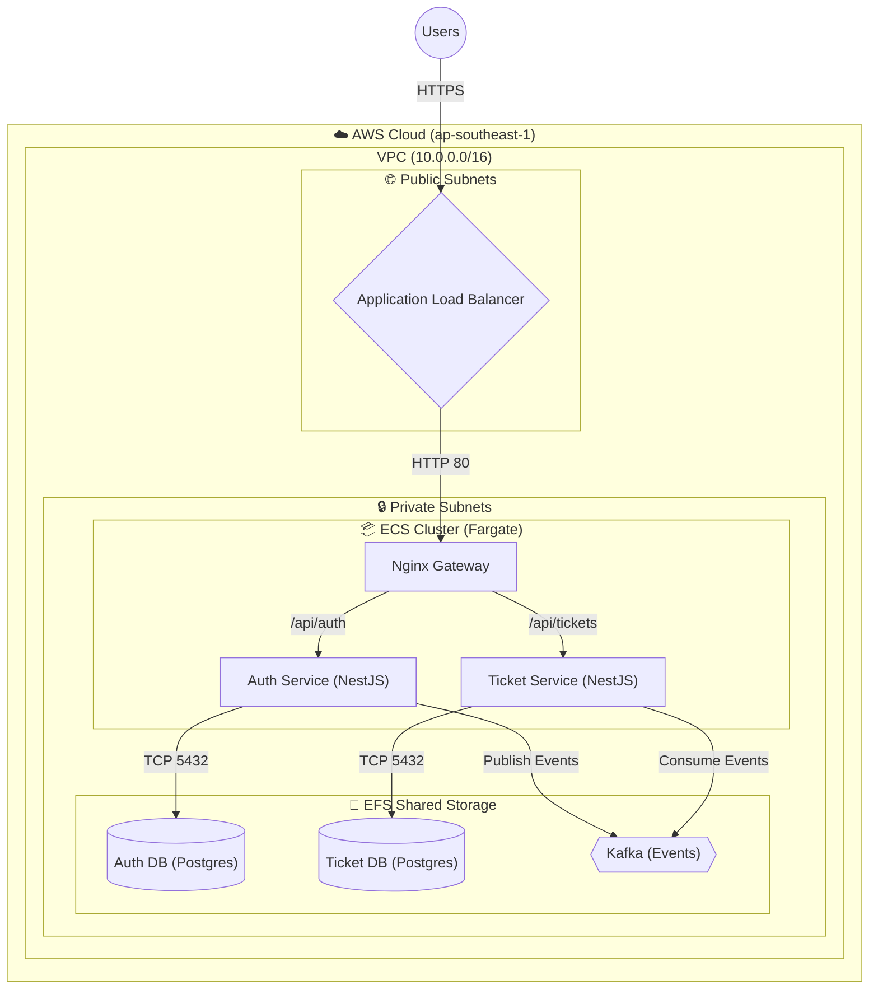

# Super System - Microservices Architecture

This repository contains the infrastructure and deployment scripts for **Super System**, a microservices-based application running on AWS ECS.

## Architecture

The system is designed with high availability and scalability in mind using AWS managed services.



### Components
1. **Application Load Balancer (ALB)**: Routes public HTTP/HTTPS traffic to the Nginx Gateway.
2. **ECS Fargate Cluster (Private Subnet)**:
   - **Nginx Gateway**: Reverse proxy routing `/api/auth` to Auth Service and `/api/tickets` to Ticket Service.
   - **Auth Service (NestJS)**: Handles user authentication and authorization.
   - **Ticket Service (NestJS)**: Handles ticket booking and management.
3. **EFS (Shared Storage)**:
   - **PostgreSQL (Auth DB)**: Stores user data.
   - **PostgreSQL (Ticket DB)**: Stores ticket data.
   - **Kafka**: Message broker for asynchronous event-driven communication between Auth and Ticket services.
4. **AWS Secrets Manager**: Securely stores environment variables and database credentials.

## Deployment

The system can be fully deployed and destroyed using the provided Bash scripts.

### Prerequisites
- AWS CLI configured with Administrator access
- Docker installed and running
- `jq` installed

### Setup
1. Create a `secrets.json` file in `infra/scripts/`:
   ```json
   {
     "POSTGRES_USER": "admin",
     "POSTGRES_PASSWORD": "securepassword123",
     "JWT_SECRET": "myjwtsecret"
   }
   ```
2. Run the deployment script:
   ```bash
   cd infra/scripts
   ./deploy-all.sh
   ```
   This will build the Docker images, push them to ECR, and deploy the entire AWS infrastructure (VPC, EFS, ECS, ALB).

### Teardown
To destroy all AWS resources and stop billing, run:
```bash
cd infra/scripts
./teardown.sh
```

## Local Development
Local development configuration uses `docker-compose.yml` (available in the respective microservices repositories).
